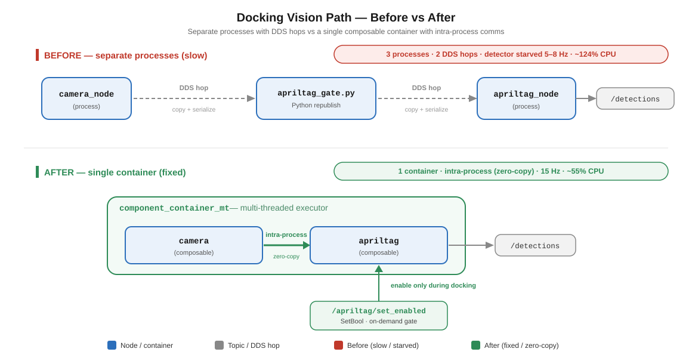

# Vision pipeline & CPU

The docking maths and the drivetrain were fine; the real wall on the real robot was
**vision latency**. This doc records why AprilTag detection went stale, the pipeline
rework that fixed it, and the on-demand gating that keeps the detector off the CPU when
nav needs it.

Grounded in the two audits (companion docs in the `openamr` instance repo):
`docs/AUDIT-2026-07-02-vision-latency-and-compute.md` (the diagnosis) and
`docs/AUDIT-2026-07-03-cpu-pipeline-optimization.md` (the architecture fix). Compute budget
and thermal are in [`04_compute_and_thermal.md`](04_compute_and_thermal.md).

---

## The symptom, and the wrong suspect

The Phase-5 visual servo oscillated left-right, drifted into the wrong tag, "aligned but
advanced badly", and threw false **"tag 1 lost"**. We rebuilt the controller (PD +
hysteresis + coast-through-dropout) and the instability *persisted* — because the problem
was not the control law.

**Root cause, by measurement.** A zero-overhead probe (`apriltag_latency.py`, reads only
`/apriltag/detections` → adds ~0 CPU, so its number is trustworthy) showed:

- `/apriltag/image_in` age ≈ **60 ms** → the image *feeding* the detector is fresh,
- `/apriltag/detections` age = **250–400 ms** (was **700 ms and growing** at `decimate 1.0`).

The detector's **input queue is backed up**: it is fed faster than it can process. A visual
servo fed 300 ms-stale positions **chases** — it corrects for where the tag *was*,
oscillates, and eventually loses lock. When the latency crossed `detection_max_age` (1.5 s)
the tag TF went stale → the lookup returned `None` → the false "tag 1 lost".

> Latency, not gains, was the dominant problem. Fix the *input* before touching the
> controller.

---

## Why the detector starved — two audits, one refinement

### 2026-07-02: "CPU saturation" (load 8 on 4 cores)

The first snapshot during a real dock showed **load ≈ 8.0 on 4 cores** (2× oversubscribed):

| Process | %CPU | Note |
|---|---|---|
| `web_video_server` | 54 % | diagnostic streamer — **kill during real runs** |
| `camera_node` | 37 % | IMX708 @ 1280×720 (software ISP) |
| `apriltag_gate.py` | 35 % | **Python re-publish of every full-res frame** |
| `apriltag_node` | 20 % | the detector itself |
| `dock_trigger.py` | 18 % | the sequencer |
| Nav2 (controller/planner/bt/behavior/costmaps) | ~45 % | **idle during the visual approach** |

Vision **input** alone (camera + gate) ≈ 72 %. The detector was starved, its queue grew,
detections went stale.

### 2026-07-03: it's the *architecture*, not the core count

`vmstat` + `mpstat` under the same load told a sharper story:

| Metric | Value | Meaning |
|---|---|---|
| CPU idle | **48–55 %** | **half the cores are FREE** |
| iowait | 0 % | not disk/USB bound |
| run-queue | 0–2 | almost nobody waiting for a core |
| swap / RAM | 0 / 2.3 GB free | not memory bound |
| temp / throttle | 50 °C / 0x0 | (that day) no thermal throttling |
| **context switches** | **35 000 / s** | pathological scheduling churn |
| system time | **20 %** | kernel shuffling messages, not computing |

**The Pi was NOT out of cores.** The image path was **3 processes and 2 DDS hops**:

```
camera_node ──DDS──▶ apriltag_gate.py ──DDS──▶ apriltag_node
 (process 1)         (process 2, Python/GIL)     (process 3)
```

Every 1280×720 RGB frame (**2.7 MB**) was **serialized + copied + DDS-delivered twice**, and
the middle hop was a **single-threaded Python node (GIL) in the hot path** re-publishing
full-res frames. That is what produced 35 k ctx/s and 20 % sys time and starved the detector
— a full-res Python passthrough in the critical path, the classic anti-pattern.

---

The before/after vision pipeline is shown below.



## The fix — intra-process composition (the root-cause fix)

Put the camera and the detector in **one** `component_container_mt` with
`use_intra_process_comms=True`. The image is passed **by pointer**: no DDS, no copy, no
Python gate.

```
┌─────────── component_container_mt (multithreaded) ───────────┐
│  camera::CameraNode ──intra-process (pointer)──▶ AprilTagNode │
│  15 fps cap, RGB888, calibrated                              │
└──────────────────────────────────────────────────────────────┘
        /camera/image_raw, /camera/camera_info
        /apriltag/detections, TF camera_optical_frame → charging_dock_tag_{0,1,2}
```

Launch: `openamrobot_docking/launch/apriltag_composed.launch.py`. Confirmed on the Pi that
`camera::CameraNode` **and** `AprilTagNode` are both composable
(`ros2 component types`). Because this launch owns libcamera, start the bring-up **without**
its own camera when you use it (the composed one is the camera).

### Camera frame-rate cap (B1) — cheap, precision-neutral

The sensor ran at 30 fps and the detector dropped 2/3 of the frames. Cap it to ~15 fps with
`FrameDurationLimits: [66667, 66667]` (µs) in the camera params. Docking never needs more
than ~15 fps. **Same resolution → zero pose-precision loss.** Effect (measured): camera
work halved, context-switches down, idle 55 % → 67 %.

### Result

| Metric | Before (3-process gate) | After (composed) |
|---|---|---|
| Detection rate | 5–8 Hz | **15 Hz** |
| Vision CPU | ~124 % | **~55 %** |
| Detection latency | 250–700 ms (growing) | ~1 frame |
| Docking outcome | oscillation / lost lock | ran end-to-end, **docked** (0.246–0.248 m, no oscillation) |

During a real composed dock: ~45 % CPU used / 55 % idle, RAM ~1.0 GB, 48 °C, no throttling.
**The Pi is not the limiter** once the plumbing is right.

> **`decimate` note.** With the composed pipeline the detector is fed cleanly at 15 Hz.
> Historically `decimate 2.0` in `tags_36h11.yaml` (½-res quad detect, full-res corner
> refine) was the sweet spot on the starved pipeline: `1.0` = 700 ms, `2.0` = ~250 ms good
> detection, `3.0` = faster but detection degrades. Lower the camera **resolution** only as
> a last resort — that *does* cost tag-pose precision, unlike the fps cap or `decimate`.

---

## On-demand AprilTag — don't pay for the detector during nav

`apriltag_node` runs the quad detector on **every** camera frame at **~1.6 cores (≈166 %
CPU)**. It is only needed during the final dock approach, yet the docking launch started it
**always-on** → during navigation the Pi sat at **load ~8** and the Nav2 planner/controller
were starved → a goal took **seconds** to start (it looked like "thinking"; it was CPU
starvation). Killing `apriltag_node` dropped load 8.3 → ~4 and the delay vanished.

Two implementations exist; both give apriltag ~0 % CPU outside docking:

### The Python gate (`apriltag_gate.py`) — for the non-composed path

A tiny node between camera and detector that republishes `/camera/image_raw` →
`/apriltag/image_in` **only while enabled**. `apriltag_node` stays alive (subscribed to
`/apriltag/image_in`) but starved → ~0 % CPU when disabled. Toggle = a boolean →
**instant (<100 ms)**, no warm-up.

- Service **`/apriltag/set_enabled`** (`std_srvs/SetBool`). `dock_trigger` **enables** at the
  staging zone (not during the Nav2 drive there, so the planner keeps the CPU) and
  **disables** in its `finally` (docked / failed / undock).
- Verified toggle cycle: apriltag CPU **1 % (off) → 102 % (on) → 1 % (off)**.
- **QoS gotcha — do not "optimise" back to best-effort.** Best-effort worked alone, but once
  `apriltag_node` also ran, the gate's best-effort camera reader got **starved** (frames
  stopped). The camera publishes **RELIABLE, KEEP_LAST 1**; the gate uses **RELIABLE** on
  both its subscription and publisher. A code comment says not to revert this.

Full write-up: [`../../ros2/src/openamrobot_docking/docs/04_apriltag.md`](../../ros2/src/openamrobot_docking/docs/04_apriltag.md).

### Composed path — ALWAYS-ON detector (there is NO on-demand gate here)

**Be clear about this — it is a real trade-off, not a free upgrade.** With the composed
container the Python gate is retired (`use_apriltag_gate:=false` in
`docking_composed.launch.py`), which makes `dock_trigger._set_apriltag()` a **no-op**. There
is **no** `LoadNode`/`UnloadNode` and **no** image gate — the composed `AprilTagNode` runs
**always-on**. The composed container's win is **zero-copy intra-process comms** (it removed
the 2-DDS-hop + 35 % Python passthrough), **not** on-demand gating.

Consequence: under the composed pipeline the **~1.6-core detector runs during ALL
navigation**, not just the approach. There is no `/apriltag/set_enabled` toggle to protect nav
here (the service is absent; a manual call is a no-op). Nav-CPU protection on the composed
path relies **entirely** on the "**deactivate idle Nav2**" lever
([`04_compute_and_thermal.md`](04_compute_and_thermal.md)), never on gating the detector.

### Choosing between the two paths

| | Composed (`bringup_composed.launch.py`) | Gated non-composed (`bringup.launch.py use_docking:=true`) |
|---|---|---|
| Image transport | **zero-copy** intra-process (~1-frame latency) | camera → `apriltag_gate.py` → detector, **2 DDS hops** |
| Detector during nav | **always-on (~1.6 cores)** — no gate | **idle (~0 %)** — gated off via `/apriltag/set_enabled` |
| Nav-CPU protection | deactivate idle Nav2 (doc 04) **only** | on-demand gate **plus** deactivate idle Nav2 |
| Detection rate / latency | 15 Hz / ~1 frame | 5–8 Hz / 250–700 ms (the starved path it replaced) |

Pick **composed** for the freshest detections during the *dock approach* (and shed nav cost by
deactivating idle Nav2). Pick the **gated non-composed** path when you specifically need the
detector to cost ~0 % during long navigation and can tolerate the 2-DDS-hop latency.

The manual toggle below exists **only** on the gated non-composed path (on the composed path
it is a no-op — the service isn't provided):

```bash
ros2 service call /apriltag/set_enabled std_srvs/srv/SetBool "{data: true}"    # on
ros2 service call /apriltag/set_enabled std_srvs/srv/SetBool "{data: false}"   # off
```

---

## Operating rules (what to actually do)

1. **Run the composed pipeline** (`bringup_composed.launch.py`) for docking when you want the
   freshest detections in the approach — it is the latency root-cause fix (15 Hz, ~55 % vision
   CPU, ~1-frame latency). **Remember its detector is always-on** — protect nav by
   deactivating idle Nav2 (rule 4), not by gating.
2. **Never run the visualization tools during a real dock** — `web_video_server` alone was
   54 % CPU and *inflates the very latency it measures*. Diagnose with it, kill it to run.
3. **Keep AprilTag off during long navigation** — this is **automatic only on the gated
   non-composed path** (`bringup.launch.py use_docking:=true` + `apriltag_gate.py`), where the
   detector idles at ~0 % until the approach. The **composed** pipeline has **no** such gate —
   its detector runs the full ~1.6 cores throughout nav, so there you must lean on rule 4.
4. **Pause / deactivate Nav2 during the visual approach** — Phase 5 drives `/cmd_vel`
   directly; the ~45 % nav stack is idle but running. Deactivating the idle nav nodes frees
   ~1.5 cores exactly when the detector needs them. (Detail + the *which nodes* nuance in
   [`04_compute_and_thermal.md`](04_compute_and_thermal.md).)
5. **Measure, don't guess** — `apriltag_latency.py` (rate + latency, ~0 CPU; target < ~120
   ms), `uptime` (load ≤ ~4), `vmstat 1` (watch **context switches** drop — the real KPI).
   Never `ros2 topic hz` over SSH (it hangs).

---

## How others avoid this (context)

The Pi 5 has **no GPU/NPU acceleration for AprilTag** — the detector runs on the CPU,
competing with Nav2. Production robots sidestep it: an NVIDIA **Jetson** runs
`isaac_ros_apriltag` on the GPU in <10 ms off the CPU; an **OAK-D** runs the detector on the
camera; and **most industrial AMRs don't use a camera + AprilTag at all** — they dock with
**2D-LiDAR reflective markers** (reuses the RPLIDAR, no camera compute, Nav2
`opennav_docking`). Camera + AprilTag is the most compute-hungry and lighting/focus-sensitive
option; we chose it for a markerless/printable target. Full comparison + the "put the
intelligence in the mechanics (V-guide)" insight: the 2026-07-02 audit and memory
`amr-lidar-docking-alternatives`.
