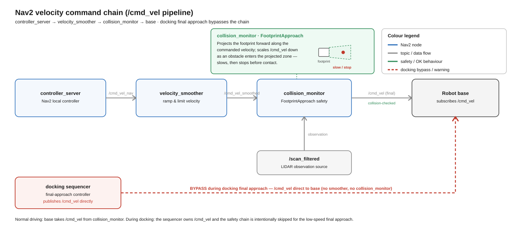

# Collision monitor

The Nav2 `collision_monitor` is the **reactive, last-resort** guard in the velocity chain: it
sits between the velocity smoother and the base and scales the command down to avoid a projected
footprint collision from the live scan. All values are quoted from
[`nav2_params.yaml`](../../ros2/src/openamrobot_nav2/config/nav2_params.yaml).

---

## 1. Where it sits

The reactive-safety command chain is shown below.




```
velocity_smoother ──► /cmd_vel_smoothed ──► collision_monitor ──► /cmd_vel ──► base
```

```yaml
collision_monitor:
  cmd_vel_in_topic: "cmd_vel_smoothed"
  cmd_vel_out_topic: "cmd_vel"
  base_frame_id: "base_link"
  odom_frame_id: "odom"
  transform_tolerance: 0.2
  source_timeout: 1.0
  base_shift_correction: True
  stop_pub_timeout: 2.0
```

It reads the already-smoothed command, checks it against the scan, and republishes the
(possibly scaled) result on `/cmd_vel`. Because it is the **last** stage, its output is what the
firmware actually receives.

---

## 2. The zone — `FootprintApproach`

There is one polygon zone, and it uses the **actual robot footprint** (from the local costmap),
not a fixed box:

```yaml
polygons: ["FootprintApproach"]
FootprintApproach:
  type: "polygon"
  action_type: "approach"
  footprint_topic: "/local_costmap/published_footprint"
  time_before_collision: 0.8
  simulation_time_step: 0.1
  min_points: 6
  enabled: True
```

**`action_type: "approach"`** is the important choice. Instead of a hard **stop zone**, the
monitor **forward-simulates the footprint** along the current command for `time_before_collision`
(0.8 s) in `simulation_time_step` (0.1 s) increments; if the projected footprint would hit
scan points, it **scales the velocity down** so the robot decelerates to just short of contact
rather than slamming to zero. `min_points: 6` requires at least 6 scan returns inside the
projection before acting, which rejects a single spurious point.

> **Historical note.** An earlier attempt used a hard **stop-zone** collision monitor. It
> **stopped the robot outright** and was abandoned in favour of the enlarged footprint for hard
> clearance. The current `approach` action is usable because it *slows* rather than hard-stops —
> it complements, rather than fights, the footprint-based avoidance in DWB. The two mechanisms
> are layered: DWB's `ObstacleFootprint` critic refuses colliding *trajectories* (planning-time),
> the collision_monitor scales the *executed* command (run-time).

---

## 3. The observation source

```yaml
observation_sources: ["scan"]
scan:
  type: "scan"
  topic: "scan_filtered"
  min_height: 0.15
  max_height: 2.0
  min_range: 0.15
  enabled: True
```

- It consumes the **same** `/scan_filtered` as the costmaps (body reflections already removed).
- **`min_range: 0.15`** here is the monitor's own near-cutoff — note this is *different* from the
  costmap `obstacle_min_range: 0.0`. The monitor ignores returns within 0.15 m (largely
  self-view / immediate noise), while the costmaps see to 0.0. Do not confuse the two.
- `source_timeout: 1.0` — if the scan stops for >1 s the source is considered stale.

Because the monitor depends on `/scan_filtered`, the same QoS and duplicate-publisher rules
apply as for the costmaps — see
[`../navigation/04_real_robot_tuning.md`](../navigation/04_real_robot_tuning.md) §3.

---

## 4. The docking self-view false positive

During the final docking approach the robot drives **toward** the dock panel; its own
close-range geometry / the dock structure appears to the docking sequencer's own obstacle guard as an imminent footprint (the Nav2 collision_monitor is itself deactivated and bypassed for the dock approach — see §1)
collision — a **self-view false positive** that would scale the approach velocity to near zero
and stall the dock.

The docking sequencer handles this by **disabling its obstacle guard for the approach**
(`obstacle_check_enabled:=false` in the dock trigger). This is safe because the dock approach is a
short, slow, camera-servoed maneuver at a known geometry, not free navigation. Detail:
[`../../ros2/src/openamrobot_docking/docs/`](../../ros2/src/openamrobot_docking/docs/README.md).

(The `docking_server` has its own, separate collision handling —
`use_collision_detection: true`, `dock_collision_threshold: 0.3`, `projection_time: 5.0` — that
operates on the local costmap during the controlled approach; that is a docking parameter, not
the Nav2 collision_monitor.)

---

## 5. Diagnosing

```bash
ros2 lifecycle get /collision_monitor           # active
ros2 topic hz /cmd_vel                           # 0 while /cmd_vel_smoothed > 0 → monitor is stopping the robot
ros2 topic echo /collision_monitor_state         # which polygon/action is engaged
ros2 topic info /scan_filtered --verbose         # source present, compatible QoS, 1 publisher
```

If the robot slows/stops for no visible obstacle: check for a self-view source (something inside
`min_range`), a stale scan (`source_timeout`), or a spurious cluster; if it's a docking approach,
this is the §4 case.

---

## Cross-links

- Full velocity chain and lifecycle → [`../navigation/01_architecture.md`](../navigation/01_architecture.md)
- Footprint-based avoidance (planning-time) → [`../navigation/02_costmaps.md`](../navigation/02_costmaps.md), [`../navigation/03_planner_controller.md`](../navigation/03_planner_controller.md)
- Velocity limits + watchdog → [`02_limits_and_watchdog.md`](02_limits_and_watchdog.md)
- Docking obstacle guard → [`../../ros2/src/openamrobot_docking/docs/`](../../ros2/src/openamrobot_docking/docs/README.md)
