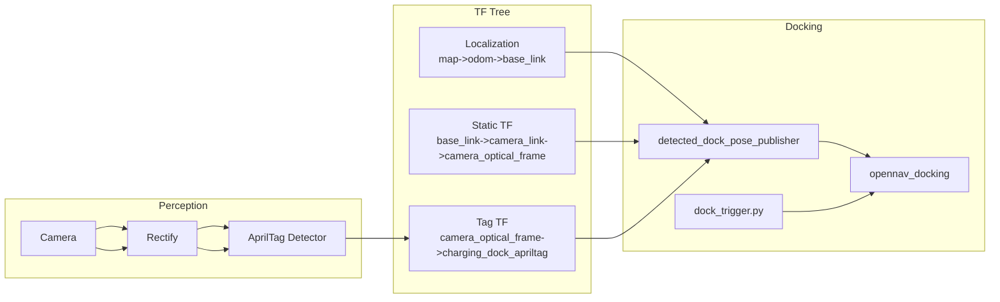
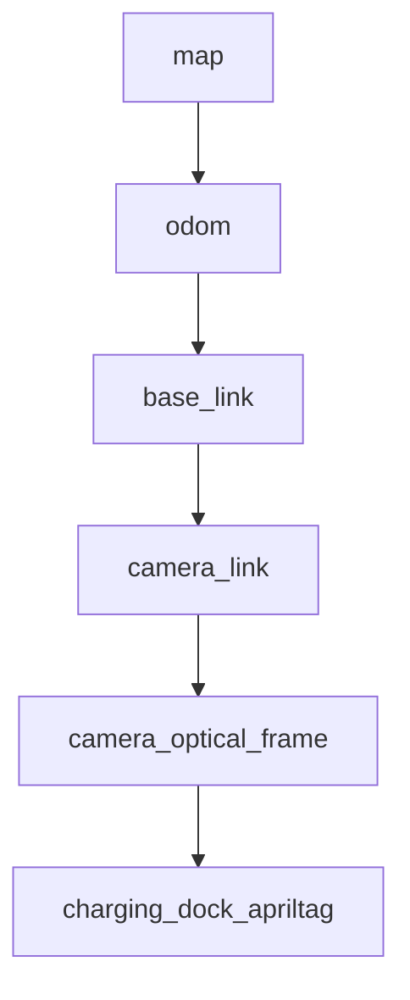
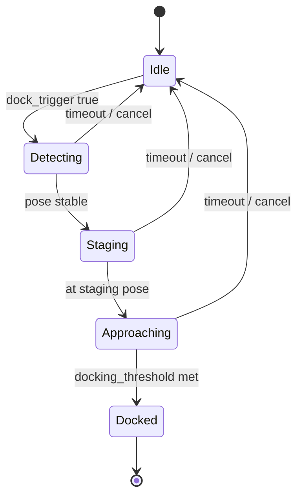
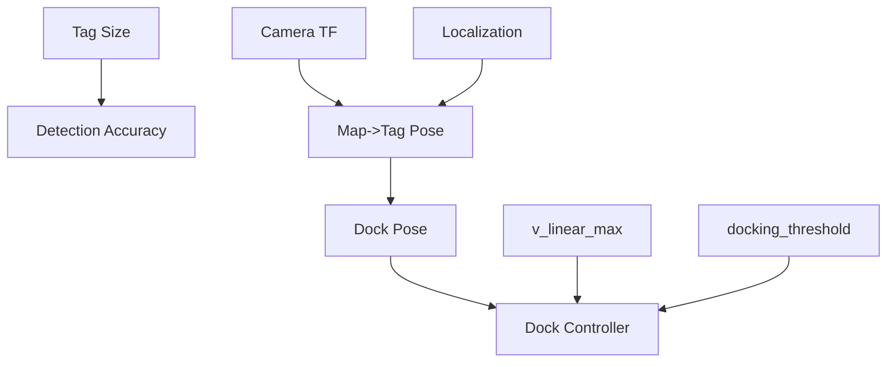

# Diagrams

These diagrams summarize the system. Use them in reports or lectures.

## System block diagram

## TF frame tree (simplified)

## Docking state flow (conceptual)

## Parameter dependency graph

