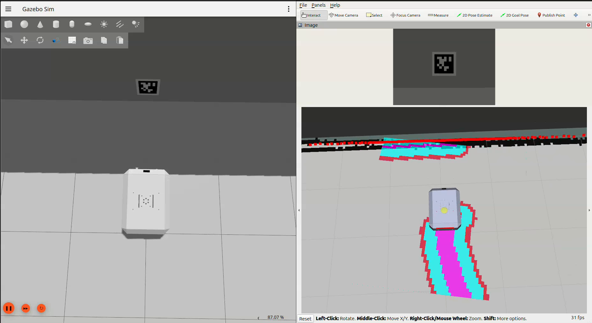

# openamrobot_docking

AprilTag-based autodocking pipeline for the **OpenAMRobot** platform.

This package contains the docking logic, the AprilTag detection pipeline, and the docking-specific simulation assets (model + textures). It composes the platform's existing description, simulation, and navigation packages — it does **not** duplicate them.

[](media/demo.mp4)

> 🎬 Click the image to watch the full 4-phase docking sequence in simulation (~72 s).

---

## At a glance

```
openamrobot_docking/
├── CMakeLists.txt
├── package.xml                           ← MIT, ament_cmake
├── README.md                             ← this file
│
├── scripts/
│   └── dock_trigger.py                   ← 4-phase docking sequencer (Python)
│
├── src/
│   └── detected_dock_pose_publisher.cpp  ← TF → /detected_dock_pose @10 Hz (C++)
│
├── launch/
│   ├── bringup_sim.launch.py             ← one command: Gazebo + Nav2 + docking
│   ├── openamrobot_docking.launch.py     ← docking layer only (Terminal 3 below)
│   ├── apriltag_sim.launch.yml           ← apriltag_ros node for simulation
│   └── detected_dock_pose_publisher.launch.py
│
├── config/
│   ├── dock_trigger.yaml                 ← 4-phase sequencer parameters
│   ├── tags_36h11_sim.yaml               ← AprilTag detector (sim, raw image)
│   └── docking_pose_publisher.yaml       ← detected_dock_pose_publisher params
│
├── models/
│   └── apriltag_dock/
│       ├── model.config
│       ├── model.sdf                     ← 0.30 × 0.30 m static panel
│       └── materials/textures/apriltag_36h11_id0.png   ← 36h11 ID=0 binary
│
├── media/
│   ├── demo.mp4                          ← 4-phase docking demo in sim
│   └── demo_preview.png                  ← frame extracted at t=36 s
│
└── docs/                                 ← engineering documentation
    ├── README.md                                  index
    ├── 00_overview.md                             what + why
    ├── 01_quickstart.md                           run the docking sim end-to-end
    ├── 02_architecture.md                         node graph, lifecycle, topics
    ├── 03_tf_frames.md                            TF chain explained
    ├── 04_apriltag.md                             AprilTag setup (sim + real)
    ├── 05_parameters.md                           every dock_trigger.yaml knob
    ├── 06_camera_calibration.md                   intrinsics flow (real robot)
    ├── 07_reproduce_results.md                    repro checklist
    ├── 08_sequencer_4phase.md                     the 4-phase pipeline, phase by phase
    ├── 09_troubleshooting.md                      symptom → cause → fix
    ├── 10_diagrams.md                             block / TF / state diagrams
    ├── 11_changes_from_upstream.md                what differs from upstream
    └── 12_lessons_learned.md                      design-decision diary
```

---

## What the package does

A standalone Python node (`dock_trigger.py`) implements a **4-phase autodocking sequence** triggered by a `Bool true` published on `/dock_trigger`:

| Phase | Action | Implementation |
|---|---|---|
| **1** | `NavigateToPose` action to the staging zone (`dock − staging_distance × approach_dir`) | Nav2 controller |
| **2** | Open-loop scan to find the tag → camera-frame centring P-controller → collect 40 detections into a `TagRunningAverage` (incremental mean for position, sign-aligned componentwise for quaternion) | `dock_trigger.py` publishing on `/cmd_vel` |
| **3** | Spin in place to the running-average `perpendicular_yaw` (heading needed to face the tag plane straight-on) | same |
| **4** | Pure-pursuit line-tracking along the perpendicular line through the averaged tag centre; the average keeps refining while the robot advances; if the tag falls out of FOV the line freezes and the robot continues along it until `docking_distance` | same |

End state: robot stopped ~0.9 m in front of the tag, perpendicular to the tag plane. Typical residual error: a few centimetres laterally, ~1° in yaw.

### Undock and undock-before-navigate

The same node also handles leaving the dock:

- **`/undock_robot`** (`std_msgs/Bool` `true`) runs the undock maneuver: reverse `undock_reverse_distance` (1.5 m) in a straight line, then spin 180° in place so the robot ends up facing away from the dock, free to navigate.
- **Undock-before-navigate**: while docked, a navigation goal must not drive the robot straight off the dock. The node owns `/goal_pose` (Nav2's `bt_navigator` is remapped to `/goal_pose_nav`), so when a goal arrives while docked it undocks first, then republishes the goal on `/goal_pose_nav` for Nav2. When the robot is *not* docked the goal passes straight through with no delay.

The node tracks an internal `is_docked` flag (set when a docking sequence completes, cleared after undock) that drives this gate.

---

## Running the docking

### One command (everything)

```bash
ros2 launch openamrobot_docking bringup_sim.launch.py
```

This starts the three layers in order — Gazebo, then Nav2 (+8 s), then the docking layer (+16 s) — so each is up before the next needs it. Slower machine? Bump the delays: `... bringup_sim.launch.py nav2_delay:=10 docking_delay:=22`.

### Or the 3 layers separately (for tuning / restarting one at a time)

`bringup_sim.launch.py` is just a convenience wrapper — the docking layer itself (`openamrobot_docking.launch.py`) does **not** start Gazebo or Nav2, it composes on top of them. Running the three separately lets you restart any one without bringing the others down. Each terminal is sourced with `source install/setup.bash` + `export RMW_IMPLEMENTATION=rmw_cyclonedds_cpp`:

```bash
# Terminal 1 — Gazebo + URDF + ros<->gz bridge
ros2 launch openamrobot_gazebo gz_simulator.launch.py

# Terminal 2 — Nav2 + localization (AMCL on saved map) + RViz
ros2 launch openamrobot_nav2 sim_bringup_launch.py

# Terminal 3 — the docking layer (this package)
ros2 launch openamrobot_docking openamrobot_docking.launch.py
```

### Triggering

Whichever way you launched, drive the sequence over topics (from anywhere, or the UI):

```bash
ros2 topic pub /dock_trigger  std_msgs/msg/Bool "{data: true}" --once   # dock
ros2 topic pub /undock_robot  std_msgs/msg/Bool "{data: true}" --once   # undock (reverse 1.5 m + 180°)
```

Or send a navigation goal (RViz "2D Goal Pose", or a `PoseStamped` on `/goal_pose`): if docked, the robot undocks first, then drives to the goal. Watch the `dock_trigger` logs to follow the phase transitions.

---

## What this package adds to the running stack

When `openamrobot_docking.launch.py` is started on top of the running Gazebo + Nav2, it brings up:

| Node | Source | Purpose |
|---|---|---|
| `/apriltag/apriltag` | `apriltag_ros::apriltag_node` (via `apriltag_sim.launch.yml`) | Detects the tag in `/rgb_image`; publishes the TF `camera_optical_frame → charging_dock_apriltag` |
| `/detected_dock_pose_publisher` | this package (C++) | Reads the chained TF `map → charging_dock_apriltag` and republishes it as `/detected_dock_pose` (PoseStamped) at 10 Hz |
| `/dock_trigger` | this package (Python) | On `/dock_trigger` (Bool) runs the 4-phase dock; on `/undock_robot` (Bool) runs the undock maneuver; gates `/goal_pose` → `/goal_pose_nav` for undock-before-navigate |
| `/camera_info_bridge` | `ros_gz_bridge` instance | Bridges the gz `/camera_info` topic to ROS (workaround for the upstream bridge that only bridges `/camera/camera_info`) |

---

## Composes (but does NOT duplicate) sibling packages

| Sibling | Role | How we use it |
|---|---|---|
| `openamrobot_description` | URDF + meshes + Gazebo plugin tags | Spawned by `_gazebo`'s launch; we read TF (`camera_optical_frame`, `base_link`) from `robot_state_publisher` |
| `openamrobot_gazebo` | Simulator bringup + ros↔gz bridge + the docking world | We require `walled_world.sdf` (which `<include>`s `model://apriltag_dock` shipped by this package) |
| `openamrobot_nav2` | Nav2 stack + AMCL + map + RViz | We invoke the Nav2 `NavigateToPose` action in Phase 1; we publish directly on `/cmd_vel` for phases 2/3/4; its `navigation_launch.py` remaps `bt_navigator`'s `goal_pose` → `goal_pose_nav` so this node can gate goals (undock-before-navigate) |

The runtime composition is declared as `<exec_depend>` in `package.xml`; no source files from these packages are copied or shipped here. The one `goal_pose` remap above is the only edit this feature needs in a sibling package.

---

## Documentation

Engineering documentation is in [`docs/`](docs/). Start there for the pipeline architecture, the TF chain, parameter reference, troubleshooting matrix, and the lessons-learned diary.

If you only have 5 minutes:
- [`docs/01_quickstart.md`](docs/01_quickstart.md) — run end-to-end
- [`docs/05_parameters.md`](docs/05_parameters.md) — what each YAML knob does
- [`docs/09_troubleshooting.md`](docs/09_troubleshooting.md) — symptom → fix

If you're tuning the controller or hitting a behavioural issue:
- [`docs/08_sequencer_4phase.md`](docs/08_sequencer_4phase.md) — the 4-phase pipeline, phase by phase

If you're migrating to a real robot:
- [`docs/04_apriltag.md`](docs/04_apriltag.md) — AprilTag setup with `camera_ros` rectification
- [`docs/06_camera_calibration.md`](docs/06_camera_calibration.md) — intrinsics + extrinsics flow
- [`docs/03_tf_frames.md`](docs/03_tf_frames.md) — TF chain the detector and the sequencer require

---

## Status

The 4-phase pipeline is tested end-to-end against the openamrobot_gazebo simulation. The same Python sequencer is hardware-agnostic — only the camera intrinsics (`camera_ros` calibration), the AprilTag panel size in `config/tags_36h11_sim.yaml`, and the dock pose in `config/dock_trigger.yaml` need to be re-grounded for a real-robot deployment.

Integration debts inherited from the simulation stack (workarounds that should ideally be resolved in the sibling packages) are documented in [`docs/12_lessons_learned.md`](docs/12_lessons_learned.md).
