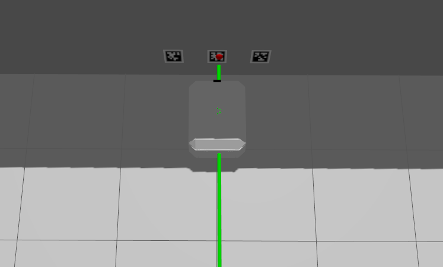

# openamrobot_docking

AprilTag-based autodocking pipeline for the **OpenAMRobot** platform.

This package contains the docking logic, the AprilTag detection pipeline, and the docking-specific simulation assets (model + textures). It composes the platform's existing description, simulation, and navigation packages — it does **not** duplicate them.



> 📸 Gazebo screenshot of the bundle-driven docking approach: the robot has converged onto the perpendicular line through the dock (the bright green cylinder), the centre tag (ID 1, with its red sphere marker) is the docking target, and the outer tags (IDs 0 and 2 at ±0.45 m) provide the wide baseline used to estimate the dock normal.

---

## At a glance

```
openamrobot_docking/
├── CMakeLists.txt
├── package.xml                           ← MIT, ament_cmake
├── README.md                             ← this file
│
├── scripts/
│   └── dock_trigger.py                   ← multi-phase bundle docking sequencer (Python)
│
├── src/
│   └── detected_dock_pose_publisher.cpp  ← TF (centre tag) → /detected_dock_pose @10 Hz (C++)
│
├── launch/
│   ├── bringup_sim.launch.py             ← one command: Gazebo + Nav2 + docking
│   ├── openamrobot_docking.launch.py     ← docking layer only (Terminal 3 below)
│   ├── apriltag_sim.launch.yml           ← apriltag_ros node for simulation
│   └── detected_dock_pose_publisher.launch.py
│
├── config/
│   ├── dock_trigger.yaml                 ← sequencer + camera-centric parameters
│   ├── tags_36h11_sim.yaml               ← AprilTag detector: 3-tag bundle IDs 0/1/2, size 0.16 m
│   └── docking_pose_publisher.yaml       ← detected_dock_pose_publisher params
│
├── models/
│   └── apriltag_dock/
│       ├── model.config
│       ├── model.sdf                     ← 3-panel bundle, 0.20×0.20 m each, outer tags at y=±0.45 m
│       └── materials/textures/
│           ├── apriltag_36h11_id0.png    ← outer tag, left  (y = −0.45 m)
│           ├── apriltag_36h11_id1.png    ← centre tag       (y =  0.00 m, docking target)
│           └── apriltag_36h11_id2.png    ← outer tag, right (y = +0.45 m)
│
├── media/
│   └── demo_preview.png                  ← Gazebo screenshot of the bundle docking
│
└── docs/                                 ← engineering documentation
    ├── README.md                                  index
    ├── 00_overview.md                             what + why
    ├── 01_quickstart.md                           run the docking sim end-to-end
    ├── 02_architecture.md                         node graph, lifecycle, topics
    ├── 03_tf_frames.md                            TF chain explained
    ├── 04_apriltag.md                             AprilTag setup (sim + real)
    ├── 05_parameters.md                           every dock_trigger.yaml knob
    ├── 06_camera_calibration.md                   intrinsics flow (real robot)
    ├── 07_reproduce_results.md                    repro checklist
    ├── 08_legacy_sequencer.md                     legacy 4-phase pipeline notes
    ├── 09_troubleshooting.md                      symptom → cause → fix
    ├── 10_diagrams.md                             block / TF / state diagrams
    ├── 11_changes_from_upstream.md                what differs from upstream
    ├── 12_lessons_learned.md                      design-decision diary
    ├── 13_perception_and_line.md                  perception + how the line is built + RViz/Gazebo markers
    └── 14_docking_research.md                     vendor-agnostic precision-docking research
```

---

## What the package does

A standalone Python node (`dock_trigger.py`) implements a **bundle-driven autodocking sequence** triggered by a `Bool true` published on `/dock_trigger`. The dock carries a **3-tag AprilTag bundle** (family 36h11, IDs 0/1/2; outer tags at `y = ±0.45 m`, centre tag at `y = 0`). The 90 cm baseline between the outer tags gives a stable surface normal that is independent of single-tag yaw jitter.

| Stage | Action | Implementation |
|---|---|---|
| **1** | `NavigateToPose` action to the staging zone (`dock − staging_distance × approach_dir`) | Nav2 controller |
| **2** | Open-loop scan to find the bundle → camera-frame centring P-controller on the bundle midpoint | `dock_trigger.py` on `/cmd_vel` |
| **3** | Estimate the dock surface **normal** from the outer tags (the line through `charging_dock_tag_0` and `charging_dock_tag_2`); back off if the robot arrived too close to re-establish a clean far-field bundle view | same |
| **4** | Drive to a point on the normal axis with pure-pursuit in the camera/tag frame, then re-verify the normal estimate within `normal_tolerance_deg` | same |
| **5** | Two-regime final approach: at `depth > freeze_axis_distance` follow the proximity-weighted-EMA axis; at `depth ≤ freeze_axis_distance` **freeze the axis** and run a visual corrector on the centre tag (`omega = −visual_servo_kp · atan2(X, Z)` in the camera optical frame) until `docking_distance` | same |

End state: robot stopped perpendicular to the dock at the configured engagement distance, the centre tag aligned with the camera centre. Typical residual error in simulation: ~1–2 cm laterally, ~1° in yaw. The longer research arc — vendor-agnostic precision targets, sensing-method catalogue, validation, failure modes — is in [`docs/14_docking_research.md`](docs/14_docking_research.md).

### Undock and undock-before-navigate

The same node also handles leaving the dock:

- **`/undock_robot`** (`std_msgs/Bool` `true`) runs the undock maneuver: reverse `undock_reverse_distance` (0.7 m) in a straight line, then spin 180° in place so the robot ends up facing away from the dock, free to navigate.
- **Undock-before-navigate**: while docked, a navigation goal must not drive the robot straight off the dock. The node owns `/goal_pose` (Nav2's `bt_navigator` is remapped to `/goal_pose_nav`), so when a goal arrives while docked it undocks first, then republishes the goal on `/goal_pose_nav` for Nav2. When the robot is *not* docked the goal passes straight through with no delay.

The node tracks an internal `is_docked` flag (set when a docking sequence completes, cleared after undock) that drives this gate.

---

## Running the docking

### One command (everything)

```bash
ros2 launch openamrobot_docking bringup_sim.launch.py
```

This starts the three layers in order — Gazebo, then Nav2 (+8 s), then the docking layer (+16 s) — so each is up before the next needs it. Slower machine? Bump the delays: `... bringup_sim.launch.py nav2_delay:=10 docking_delay:=22`.

For headless simulation without Gazebo GUI or RViz:

```bash
ros2 launch openamrobot_docking bringup_sim.launch.py gazebo_gui:=false use_rviz:=false
```

### Or the 3 layers separately (for tuning / restarting one at a time)

`bringup_sim.launch.py` is just a convenience wrapper — the docking layer itself (`openamrobot_docking.launch.py`) does **not** start Gazebo or Nav2, it composes on top of them. Running the three separately lets you restart any one without bringing the others down. Each terminal is sourced with `source install/setup.bash` + `export RMW_IMPLEMENTATION=rmw_cyclonedds_cpp`:

```bash
# Terminal 1 — Gazebo + URDF + ros<->gz bridge
ros2 launch openamrobot_gazebo gz_simulator.launch.py

# Terminal 2 — Nav2 + localization (AMCL on saved map) + RViz
ros2 launch openamrobot_nav2 sim_bringup_launch.py

# Terminal 3 — the docking layer (this package)
ros2 launch openamrobot_docking openamrobot_docking.launch.py
```

### Triggering

Whichever way you launched, drive the sequence over topics (from anywhere, or the UI):

```bash
ros2 topic pub /dock_trigger  std_msgs/msg/Bool "{data: true}" --once   # dock
ros2 topic pub /undock_robot  std_msgs/msg/Bool "{data: true}" --once   # undock (reverse 0.7 m + 180°)
```

Or send a navigation goal (RViz "2D Goal Pose", or a `PoseStamped` on `/goal_pose`): if docked, the robot undocks first, then drives to the goal. Watch the `dock_trigger` logs to follow the phase transitions.

---

## What this package adds to the running stack

When `openamrobot_docking.launch.py` is started on top of the running Gazebo + Nav2, it brings up:

| Node | Source | Purpose |
|---|---|---|
| `/apriltag/apriltag` | `apriltag_ros::apriltag_node` (via `apriltag_sim.launch.yml`) | Detects the 3-tag bundle in `/rgb_image`; publishes one TF per tag: `camera_optical_frame → charging_dock_tag_{0,1,2}` |
| `/detected_dock_pose_publisher` | this package (C++) | Reads the chained TF `map → charging_dock_tag_1` (centre tag) and republishes it as `/detected_dock_pose` (PoseStamped) at 10 Hz |
| `/dock_trigger` | this package (Python) | On `/dock_trigger` (Bool) runs the bundle docking; on `/undock_robot` (Bool) runs the undock maneuver; gates `/goal_pose` → `/goal_pose_nav` for undock-before-navigate |
| `/camera_info_bridge` | `ros_gz_bridge` instance | Bridges the gz `/camera_info` topic to ROS (workaround for the upstream bridge that only bridges `/camera/camera_info`) |

---

## Composes (but does NOT duplicate) sibling packages

| Sibling | Role | How we use it |
|---|---|---|
| `openamrobot_description` | URDF + meshes + Gazebo plugin tags | Spawned by `_gazebo`'s launch; we read TF (`camera_optical_frame`, `base_link`) from `robot_state_publisher` |
| `openamrobot_gazebo` | Simulator bringup + ros↔gz bridge + the docking world | We require `walled_world.sdf` (which `<include>`s `model://apriltag_dock` shipped by this package) |
| `openamrobot_nav2` | Nav2 stack + AMCL + map + RViz | We invoke the Nav2 `NavigateToPose` action in Phase 1; we publish directly on `/cmd_vel` for phases 2/3/4; its `navigation_launch.py` remaps `bt_navigator`'s `goal_pose` → `goal_pose_nav` so this node can gate goals (undock-before-navigate) |

The runtime composition is declared as `<exec_depend>` in `package.xml`; no source files from these packages are copied or shipped here. The one `goal_pose` remap above is the only edit this feature needs in a sibling package.

---

## Documentation

Engineering documentation is in [`docs/`](docs/). Start there for the pipeline architecture, the TF chain, parameter reference, troubleshooting matrix, and the lessons-learned diary.

If you only have 5 minutes:
- [`docs/01_quickstart.md`](docs/01_quickstart.md) — run end-to-end
- [`docs/05_parameters.md`](docs/05_parameters.md) — what each YAML knob does
- [`docs/09_troubleshooting.md`](docs/09_troubleshooting.md) — symptom → fix

If you're tuning the controller or hitting a behavioural issue:
- [`docs/13_perception_and_line.md`](docs/13_perception_and_line.md) — how the bundle pose and the perpendicular line are built (and visualised in RViz / Gazebo)
- [`docs/05_parameters.md`](docs/05_parameters.md) — every `dock_trigger.yaml` knob
- [`docs/08_legacy_sequencer.md`](docs/08_legacy_sequencer.md) — notes on the legacy 4-phase pipeline (kept for context)

If you're working on the precision / robustness arc:
- [`docs/14_docking_research.md`](docs/14_docking_research.md) — vendor-agnostic precision-docking research (chargers, sensing methods, validation protocol, failure modes, calibration & commissioning)

If you're migrating to a real robot:
- [`docs/04_apriltag.md`](docs/04_apriltag.md) — AprilTag setup with `camera_ros` rectification
- [`docs/06_camera_calibration.md`](docs/06_camera_calibration.md) — intrinsics + extrinsics flow
- [`docs/03_tf_frames.md`](docs/03_tf_frames.md) — TF chain the detector and the sequencer require

---

## Status

The bundle-driven pipeline is tested end-to-end against the openamrobot_gazebo simulation. The same Python sequencer is hardware-agnostic — only the camera intrinsics (`camera_ros` calibration), the AprilTag panel sizes in `config/tags_36h11_sim.yaml`, and the dock pose in `config/dock_trigger.yaml` need to be re-grounded for a real-robot deployment.

Integration debts inherited from the simulation stack (workarounds that should ideally be resolved in the sibling packages) are documented in [`docs/12_lessons_learned.md`](docs/12_lessons_learned.md).
