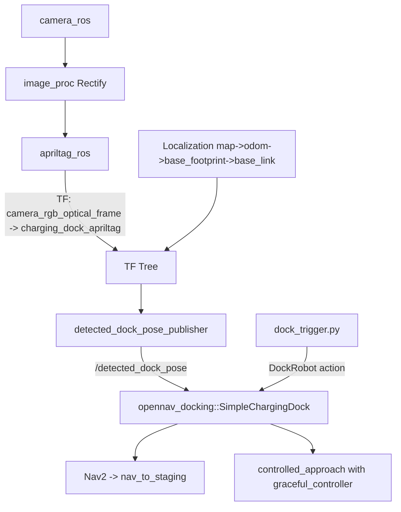
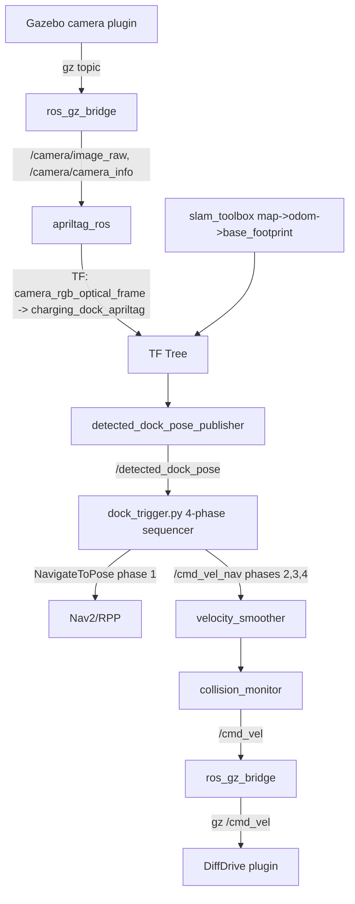

# Docking Pipeline

This package supports two docking flows that share the same AprilTag
detection backbone:

- **Real robot** — uses `opennav_docking::SimpleChargingDock` with
  `graceful_controller`. Configured in `config/openamrobot_docking.yaml`.
  Triggered by `dock_trigger.py` calling the `DockRobot` action.
- **Simulation** — uses a **custom 4-phase sequencer** in `dock_trigger.py`
  that performs `Nav2 → scan/filter → align → line-tracking advance`.
  Bypasses `opennav_docking`'s controller. Detailed in
  `08_sequencer_4phase.md`.

The current `dock_trigger.py` always runs the 4-phase sequence (it does
not fall back to the `DockRobot` action). To use `opennav_docking` on
the real robot, either restore the older single-action `dock_trigger.py`
(see git history) or write a minimal alternative trigger that calls
`DockRobot` instead.

## Package layout for the docking pipeline

```
openamrobot-docking-main/
├── omr_description/                  ← canonical OMR robot description
│   ├── urdf/omr_robot.urdf.xacro     (URDF/xacro + base_footprint +
│   ├── urdf/gazebo_control.xacro      DiffDrive, gpu_lidar, camera with
│   └── meshes/{visual,collision}/     optical frame, JointStatePublisher)
│
└── openamrobot_docking/              ← docking pipeline + simulation world
    ├── launch/
    │   ├── apriltag.launch.yml              # real-robot AprilTag (with camera_ros)
    │   ├── apriltag_sim.launch.yml          # sim AprilTag (no camera_ros)
    │   ├── detected_dock_pose_publisher.launch.py
    │   └── openamrobot_docking.launch.py    # real-robot top-level launch
    ├── config/
    │   ├── docking_pose_publisher.yaml
    │   ├── dock_trigger.yaml                # used by both flows
    │   ├── openamrobot_docking.yaml         # real-robot Nav2 + docking_server
    │   └── tags_36h11.yaml                  # real-robot AprilTag config
    ├── simulation/
    │   ├── launch/simulation.launch.py      # spawns from omr_description
    │   ├── worlds/docking_world.sdf         # walls + AprilTag dock (no robot)
    │   ├── models/apriltag_dock/            # tag panel + tag36h11 texture
    │   └── config/
    │       ├── nav2_sim_full.yaml
    │       ├── ros_gz_bridge.yaml
    │       ├── slam_toolbox_params.yaml
    │       ├── tags_36h11_sim.yaml
    │       └── simulation.rviz
    ├── src/detected_dock_pose_publisher.cpp
    └── scripts/dock_trigger.py
```

Note: the OMR robot description used to live as an inline SDF model in
`openamrobot_docking/simulation/models/omr_robot/`. It is now a separate
ROS 2 package (`omr_description/`) with a SolidWorks-exported URDF/xacro,
attributed in `NOTICE.md`. The simulation launch spawns the robot at
runtime via `ros_gz_sim create` from the xacro-expanded URDF.

## Common detection pipeline

Both flows share these steps to get a tag pose into the `map` frame:

1. Camera → image → AprilTag detection.
2. AprilTag node publishes TF: `camera_rgb_optical_frame →
   charging_dock_apriltag`.
3. A TF chain `map → odom → base_footprint → base_link → camera_link
   → camera_rgb_optical_frame` exists (via SLAM/AMCL + URDF static
   transforms).
4. `detected_dock_pose_publisher` (a small C++ node in `src/`) looks up
   TF `map → charging_dock_apriltag` at 10 Hz and publishes it as
   `geometry_msgs/PoseStamped` on `/detected_dock_pose`.

## Flow A — Real robot (`opennav_docking`)

```
[ camera_ros ]
   ↓ /camera/image_raw, /camera/camera_info
[ image_proc::RectifyNode ]
   ↓ /image_rect
[ apriltag_ros::AprilTagNode ]
   ↓ TF camera_rgb_optical_frame → charging_dock_apriltag
   ↓ /apriltag/detections
[ detected_dock_pose_publisher ]
   ↓ /detected_dock_pose (PoseStamped in map)
[ opennav_docking::SimpleChargingDock ]   ← params from openamrobot_docking.yaml
   ↳ nav_to_staging_pose  (uses Nav2)
   ↳ initial_perception   (waits for /detected_dock_pose)
   ↳ controlled_approach  (graceful_controller drives toward dock_pose)
   ↳ wait_for_charge / is_docked

dock_trigger.py — Bool true → DockRobot action goal
```

Key params in `config/openamrobot_docking.yaml`:

```yaml
home_dock_plugin:
  use_external_detection_pose: true
  staging_x_offset: -0.7
  docking_threshold: 0.25
  external_detection_rotation_pitch: -1.5707
  external_detection_rotation_roll: -1.5707
  external_detection_rotation_yaw: 0.0
  external_detection_translation_x: 0.18    # IMPORTANT: shifts dock pose toward robot
  external_detection_translation_y: 0.0

home_dock:
  frame: map
  pose: [<map_x>, <map_y>, <yaw>]           # set from your tag's actual map position
```

See `04_apriltag.md` for measuring `home_dock.pose` on the real robot,
and `11_changes_from_upstream.md` for why
`external_detection_translation_x: +0.18` (vs `−0.18` in the upstream).

## Flow B — Simulation (custom 4-phase sequencer)

```
[ Gazebo camera plugin ]
   ↓ /camera/image_raw, /camera/camera_info via ros_gz_bridge
[ apriltag_ros::AprilTagNode ]   (no rectification — sim camera is pinhole, undistorted)
   ↓ TF camera_rgb_optical_frame → charging_dock_apriltag
[ detected_dock_pose_publisher ]
   ↓ /detected_dock_pose (PoseStamped in map)
[ dock_trigger.py — 4 phases ]
   1. NavigateToPose → staging zone (Nav2)
   2. Scan to centre tag in camera + filter 40 samples (running average)
   3. ALIGN — spin in place to perpendicular yaw
   4. Line-tracking advance (pure-pursuit) → final align → straight-line
```

Read `08_sequencer_4phase.md` for the full implementation rationale and
tunables.

The simulation also has `opennav_docking::SimpleChargingDock` configured
in `simulation/config/nav2_sim_full.yaml` (with the same set of
`external_detection_*` params), but it is **not actually invoked** by the
sim's `dock_trigger.py` — kept for reference only.

## Configurable spawn pose in the simulation launch

`simulation.launch.py` accepts three launch arguments:

```bash
ros2 launch openamrobot_docking simulation.launch.py \
    spawn_x:=-4.0 spawn_y:=-4.0 spawn_yaw:=0.0
```

Defaults are `(-4, -4, 0)`. The SLAM map's origin coincides with the
spawn pose, so the dock's coordinates in the map frame depend on where
the robot starts. The launch file computes:

```
dock_in_map = R(−spawn_yaw) · (dock_in_world − spawn_in_world)
```

from the fixed world dock pose `(0, 4.9, π/2)` and overrides
`dock_pose_x`, `dock_pose_y`, `dock_pose_yaw` on the `dock_trigger`
node. The yaml only provides the default for the default spawn pose.

## Mermaid block diagram (real robot)



## Mermaid block diagram (simulation)



## How `dock_trigger.py` is wired

The current `scripts/dock_trigger.py` ALWAYS runs the 4-phase sequence:

```python
on /dock_trigger == true:
    run_docking_sequence()      # phases 1..4, see 08_sequencer_4phase.md
on /dock_trigger == false and undock_on_false:
    DockRobot action UndockRobot goal to opennav_docking
```

The same script is installed by `CMakeLists.txt` and used by both the
simulation launch and the real-robot launch. Both ultimately publish to
`/cmd_vel_nav` (sim: directly during phases 2/3/4; real: via Nav2's
controller_server during phase 1). If you want to use
`opennav_docking::SimpleChargingDock` on the real robot instead of the
4-phase flow, you will need to either:

- Restore an older revision of `dock_trigger.py` that just calls the
  `DockRobot` action (see git history), OR
- Write a minimal alternative trigger script that calls `DockRobot`
  and configure `openamrobot_docking.launch.py` to launch that one
  instead.
