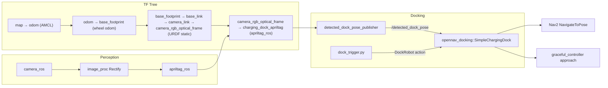
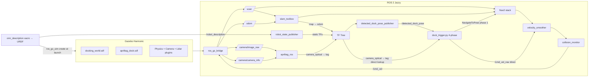
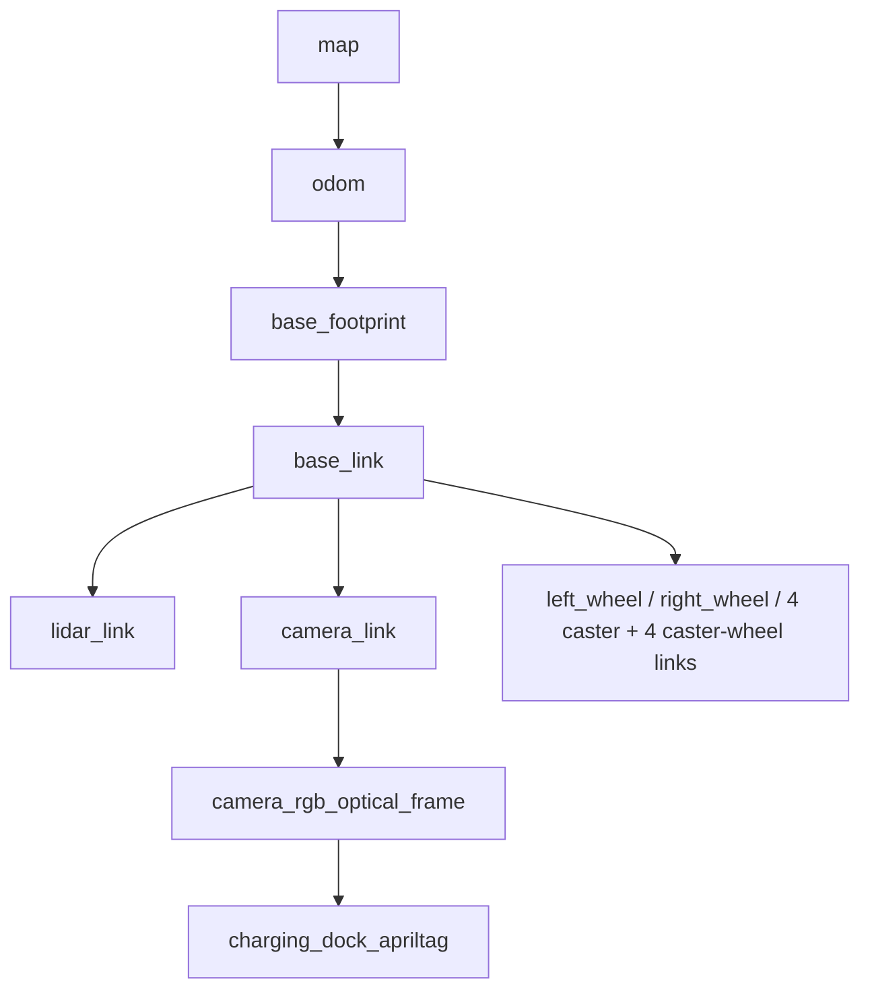
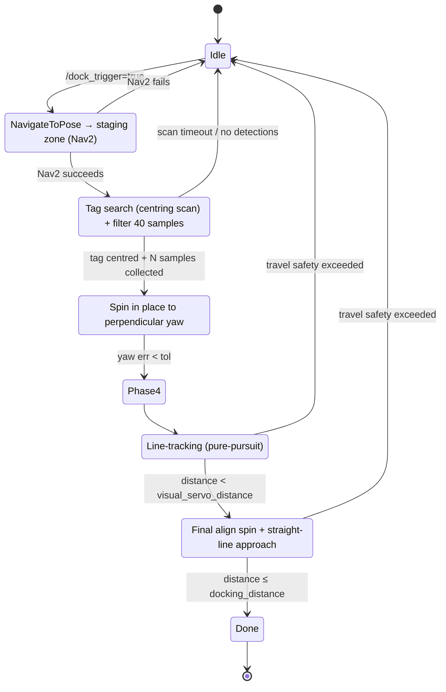
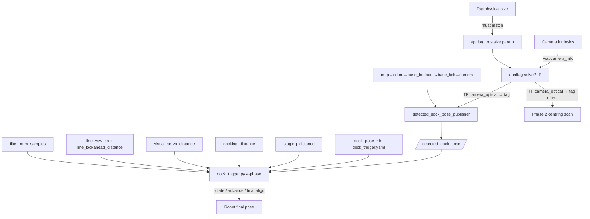
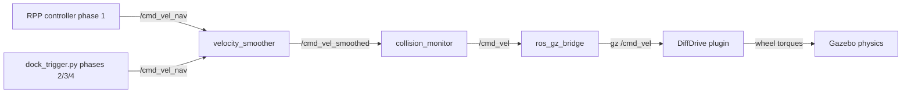

# Diagrams

Mermaid diagrams summarising the docking system. Use them in reports
or lectures.

## System block diagram (real robot, opennav_docking flow)



## System block diagram (simulation, 4-phase sequencer)



## TF tree (simulation)



`map → odom` from `slam_toolbox`. `odom → base_footprint` from the
`DiffDrive` plugin. Everything below is static, from the
`omr_description` xacro.

## 4-phase docking state machine



## Parameter dependency graph



## Velocity command chain (simulation)



When debugging "robot doesn't move", check each topic's
`ros2 topic hz` to find which link is silent.

## Trajectory schematic (simulation, 4-phase)

```
  ↑ y (map north)
  │
  ████████████████████████  ← North wall (y = 9 in map)
  │  ┌──┐ tag at (4, 8.9)
  │  └──┘
  │     ▲                    phase 4b: final-align spin then straight forward
  │     │                              (omega = 0, last 0.5 m)
  │  ─ ─ ─ ─ ─ ─ ─ ─        ← visual_servo_distance threshold at (4, 7.5)
  │   ╱                      phase 4a: line-tracking (pure-pursuit)
  │  ╱                                 curves robot back onto x = 4 axis
  │ ╱
  │●  ← staging zone (4, 6.4) — robot stops, scans, filters
  │ ╲                        phase 1: Nav2 plans + RPP follows path
  │  ╲
  │   ●  ← robot spawn at map (0, 0)
  │
  └──────────────────────────→ x (map east)
```

The line-tracking phase converges the lateral offset to zero while
advancing, then the final-align + straight-line phase guarantees a
clean perpendicular arrival at the dock.
