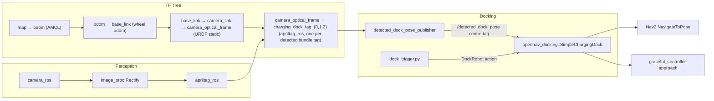
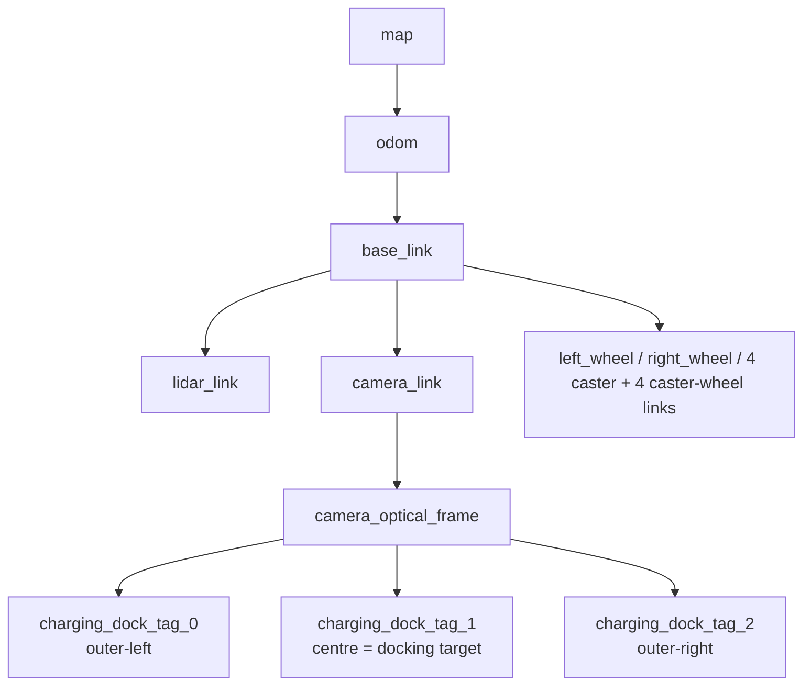
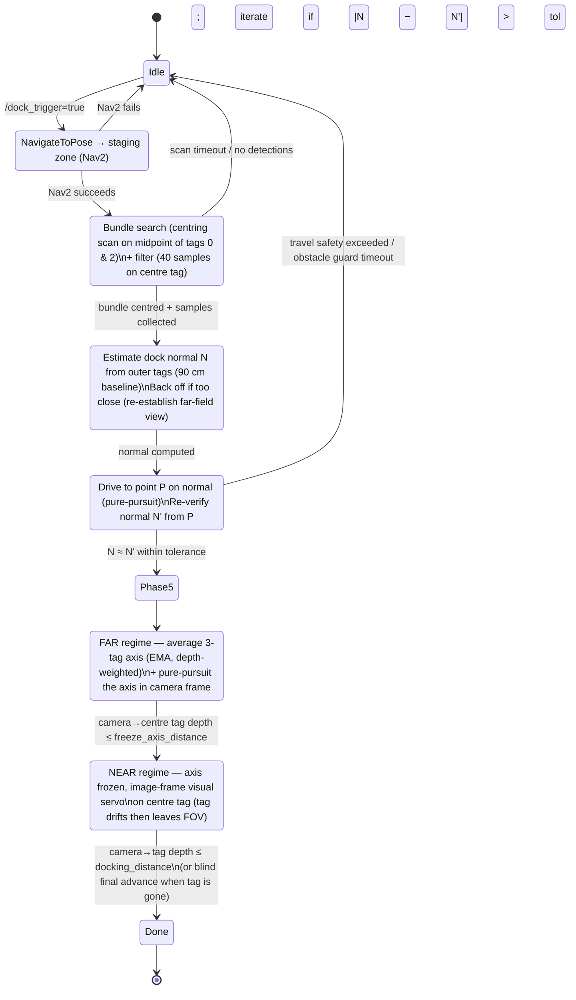

# Diagrams

Mermaid diagrams summarising the docking system. Use them in reports
or lectures.

## System block diagram (real robot, opennav_docking flow)


```mermaid
graph LR
  subgraph SENSORS[Perception]
    CAM[camera_ros]
    RECT[image_proc Rectify]
    TAG[apriltag_ros]
    CAM --> RECT --> TAG
  end

  subgraph TF[TF Tree]
    LOC["map → odom (AMCL)"]
    ODOM["odom → base_link (wheel odom)"]
    URDF["base_link → camera_link → camera_optical_frame (URDF static)"]
    TAGTF["camera_optical_frame → charging_dock_tag_{0,1,2} (apriltag_ros, one per detected bundle tag)"]
    LOC --> ODOM --> URDF --> TAGTF
  end

  subgraph DOCK[Docking]
    DET[detected_dock_pose_publisher]
    SERVER[opennav_docking::SimpleChargingDock]
    TRIG[dock_trigger.py]
  end

  TAG --> TAGTF
  TAGTF --> DET
  DET -->|/detected_dock_pose centre tag| SERVER
  TRIG -->|DockRobot action| SERVER
  SERVER --> NAV[Nav2 NavigateToPose]
  SERVER --> APP[graceful_controller approach]
```

## System block diagram (simulation, bundle sequencer)

```mermaid
graph LR
  subgraph GZ[Gazebo Harmonic]
    WORLD[walled_world.sdf]
    DOCK_SDF[apriltag_dock.sdf<br/>3 coplanar 0.20 m panels<br/>outer tags at y = ±0.45 m]
    PHYSICS[Physics + Camera + Lidar plugins]
  end

  XACRO[openamrobot_description xacro → URDF] -->|/robot_description| RSP[robot_state_publisher]
  XACRO -->|ros_gz_sim create at launch| GZ

  GZ --> BR[ros_gz_bridge]

  subgraph ROS[ROS 2 Jazzy]
    BR --> SCAN[/scan/]
    BR --> ODOM_T[/odom/]
    BR --> CAM_IMG[/rgb_image/]
    BR --> CAM_INFO[/camera_info/]

    CAM_INFO --> SYNC[camera_info_sync<br/>stamps to image time]
    CAM_IMG --> APRIL[apriltag_ros]
    SYNC -->|/camera_info_synced| APRIL

    SCAN --> AMCL[AMCL localiser]
    ODOM_T --> AMCL
    AMCL -->|map → odom| TFTREE

    RSP -->|static TFs| TFTREE[TF Tree]
    APRIL -->|3× camera_optical → tag_{0,1,2}| TFTREE

    TFTREE -->|centre tag only| DPP[detected_dock_pose_publisher]
    DPP -->|/detected_dock_pose| TRIG[dock_trigger.py<br/>bundle sequencer]
    TFTREE -->|3× outer + centre direct lookup| TRIG

    SCAN --> SBF[scan_body_filter<br/>chops rear ±40°]
    SBF --> NAV2[Nav2 stack]
    AMCL --> NAV2
    TRIG -->|NavigateToPose phase 1| NAV2
    NAV2 -->|/cmd_vel| BR
    TRIG -->|/cmd_vel direct phases 2-5| BR
    SBF -.->|forward-cone obstacle guard| TRIG
  end
```

## TF tree (simulation)


```mermaid
graph TD
  MAP[map]
  ODOM[odom]
  BFP[base_link]
  LIDAR[lidar_link]
  CAML[camera_link]
  CAMOPT[camera_optical_frame]
  TAG0[charging_dock_tag_0<br/>outer-left]
  TAG1[charging_dock_tag_1<br/>centre = docking target]
  TAG2[charging_dock_tag_2<br/>outer-right]
  WHEELS[left_wheel / right_wheel / 4 caster + 4 caster-wheel links]

  MAP --> ODOM --> BFP
  BFP --> LIDAR
  BFP --> CAML --> CAMOPT
  CAMOPT --> TAG0
  CAMOPT --> TAG1
  CAMOPT --> TAG2
  BFP --> WHEELS
```

`map → odom` from AMCL. `odom → base_link` from the `DiffDrive`
plugin. Everything down to `camera_optical_frame` is static (from the
`openamrobot_description` xacro). The three `camera_optical_frame →
charging_dock_tag_{0,1,2}` transforms are dynamic, published by
`apriltag_ros` whenever the corresponding tag is detected.

## Bundle docking state machine


```mermaid
stateDiagram-v2
  [*] --> Idle
  Idle --> Phase1 : /dock_trigger=true

  Phase1 : NavigateToPose → staging zone (Nav2)
  Phase1 --> Phase2 : Nav2 succeeds
  Phase1 --> Idle : Nav2 fails

  Phase2 : Bundle search (centring scan on midpoint of tags 0 & 2)\n+ filter (40 samples on centre tag)
  Phase2 --> Phase3 : bundle centred + samples collected
  Phase2 --> Idle : scan timeout / no detections

  Phase3 : Estimate dock normal N from outer tags (90 cm baseline)\nBack off if too close (re-establish far-field view)
  Phase3 --> Phase4 : normal computed

  Phase4 : Drive to point P on normal (pure-pursuit)\nRe-verify normal N' from P; iterate if |N − N'| > tol
  Phase4 --> Phase5 : N ≈ N' within tolerance
  Phase4 --> Idle : travel safety exceeded / obstacle guard timeout

  Phase5a : FAR regime — average 3-tag axis (EMA, depth-weighted)\n+ pure-pursuit the axis in camera frame
  Phase5 --> Phase5a
  Phase5a --> Phase5b : camera→centre tag depth ≤ freeze_axis_distance

  Phase5b : NEAR regime — axis frozen, image-frame visual servo\non centre tag (tag drifts then leaves FOV)
  Phase5b --> Done : camera→tag depth ≤ docking_distance\n(or blind final advance when tag is gone)

  Done --> [*]
```

## Parameter dependency graph

```mermaid
graph TD
  TAGSIZE[Tag panel size 0.20 m → 0.16 m black-square edge] -->|must match| TAGCFG[apriltag_ros size param]
  CAMINTR[Camera intrinsics] -->|via /camera_info → camera_info_sync → /camera_info_synced| SOLVEPNP[apriltag solvePnP]
  TAGCFG --> SOLVEPNP
  SOLVEPNP -->|3× TF camera_optical → tag_{0,1,2}| DET[detected_dock_pose_publisher tracks tag_1]
  SOLVEPNP -->|3× TF camera_optical → tag_{0,1,2} direct| BUNDLE[Bundle sequencer<br/>normal estimation + IBVS]
  TFCHAIN[map→odom→base_link→camera] --> DET
  DET --> POSE[/detected_dock_pose centre tag/]
  POSE --> TRIG[dock_trigger.py bundle sequencer]
  BUNDLE --> TRIG
  STATIC[dock_pose_* in dock_trigger.yaml] --> TRIG
  STAGING[staging_distance] --> TRIG
  DOCKING[docking_distance] --> TRIG
  LINE[line_yaw_kp + line_lookahead_distance] --> TRIG
  AXIS[freeze_axis_distance + axis_filter_alpha] --> TRIG
  NORMAL[predock_distance + normal_tolerance_deg] --> TRIG
  OBSGUARD[obstacle_* params] --> TRIG
  TRIG -->|rotate / advance / final servo| OUTPUT[Robot final pose ~15 cm in front of centre tag, perpendicular]
```

## Velocity command chain (simulation, Raj's setup)

```mermaid
graph LR
  RPP[Nav2 controller phase 1] -->|action result| ACT[NavigateToPose action server]
  ACT -->|/cmd_vel Nav2 internals| BR
  TRIG[dock_trigger.py phases 2-5] -->|/cmd_vel direct| BR
  BR[ros_gz_bridge] -->|gz /cmd_vel| DD[DiffDrive plugin]
  DD -->|wheel torques| GZ[Gazebo physics]
  SCAN[/scan_filtered/<br/>= /scan minus rear ±40°<br/>scan_body_filter] -.->|obstacle guard| TRIG
```

> Phase 1 uses the Nav2 `NavigateToPose` action (its internal cmd_vel is published by Nav2's controller_server and routed through the Nav2 internals to `/cmd_vel`). Phases 2–5 publish **directly on `/cmd_vel`** because Raj's Nav2 stack does not run a `velocity_smoother` subscribed to `/cmd_vel_nav` — there is no smoothing layer to go through. To compensate for the missing `collision_monitor` on the direct path, the bundle sequencer runs its own LIDAR-cone obstacle guard (see [`05_parameters.md`](05_parameters.md), "Obstacle guard"). The guard is **off during Phase 5** — the dock is the target.

When debugging "robot doesn't move", check each topic's
`ros2 topic hz` to find which link is silent.

## Trajectory schematic (simulation, bundle pipeline, Raj's world)

```
                                     ↑ +y (map north)
                                     │
                                     │
   ██████████████████████████████████│██████████████████████████  ← East wall
                                     │                       ┌─┐    (x = 5)
                                     │                       │ │ tag id 2 at (4.899, +0.45)
                                     │                       └─┘
                                     │                       ┌─┐
                                     │                       │ │ tag id 1 (centre) at (4.899, 0) — docking target
                                     │                       └─┘
                                     │                       ┌─┐
                                     │                       │ │ tag id 0 at (4.899, −0.45)
                                     │                       └─┘
                                     │                        ▲
   ─ ─ ─ ─ ─ ─ ─ ─ ─ ─ ─ ─ ─ ─ ─ ─ ─ ── ── ── ── ── ── ── ── ●─┴── ← Phase 5: IBVS final approach
                                     │                                ends ~15 cm camera→tag depth
                                     │                       ▲
                                     │                       │
                                     │                       ● ← Phase 4 point on normal (~1.5-2 m from dock)
                                     │                       │   Re-verify normal N' from here
                                     │                       │
                                     │                       ● ← staging at (2.899, 0) — Phase 1 stop
                                     │                       │     phase 2: bundle search + centring scan
                                     │                       │     phase 3: estimate normal from outer tags
                                     │                       │
                                     ● ← robot spawn at (0, 0)  phase 1: Nav2 plans + tracks
   ──────────────────────────────────┼────────────────────────────────→ +x (map east)
                                     │
```

The robot starts at the map origin, navigates ~2.9 m east to the staging
zone, scans + filters the bundle there, estimates the dock surface
normal from the outer tags' wide baseline (0.90 m → robust against
single-tag yaw jitter), drives to a point on the normal and re-verifies,
then runs the two-regime final approach: pure-pursuit on the
EMA-averaged axis (FAR) → frozen axis + image-frame visual servo on
the centre tag (NEAR), finishing with camera→tag depth ≈ 0.15 m
perpendicular to the dock face.
